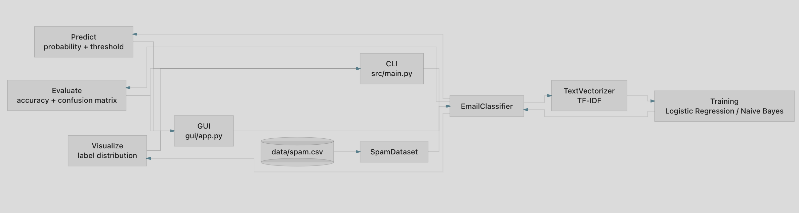
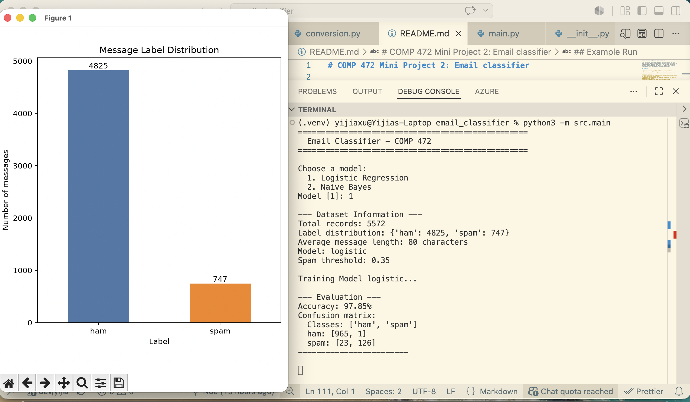
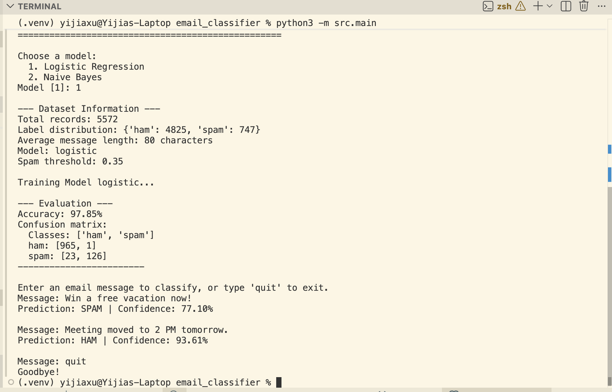
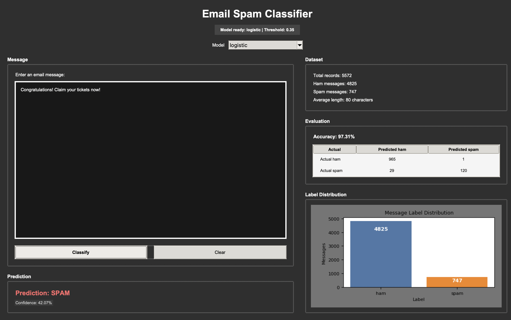
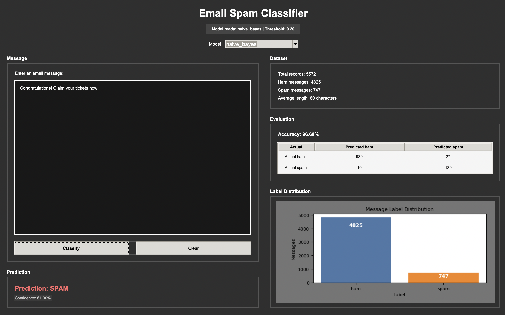
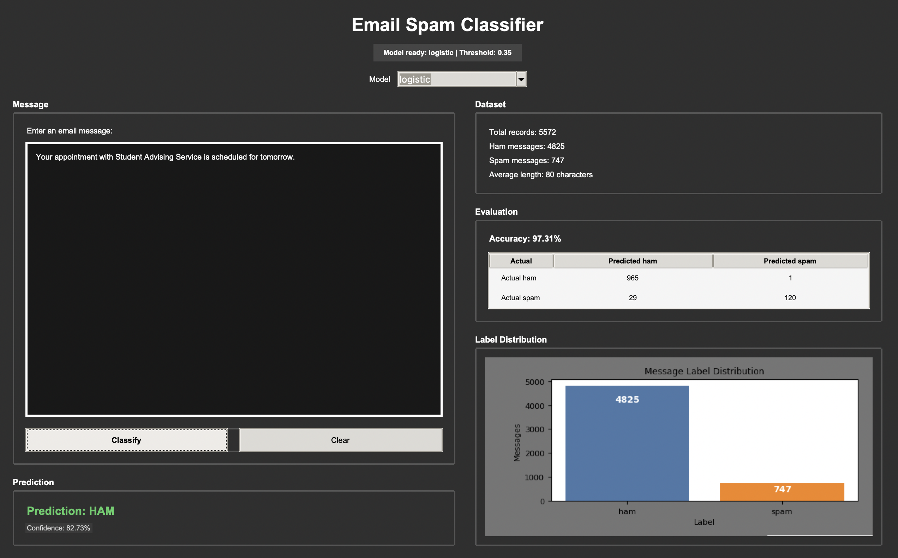
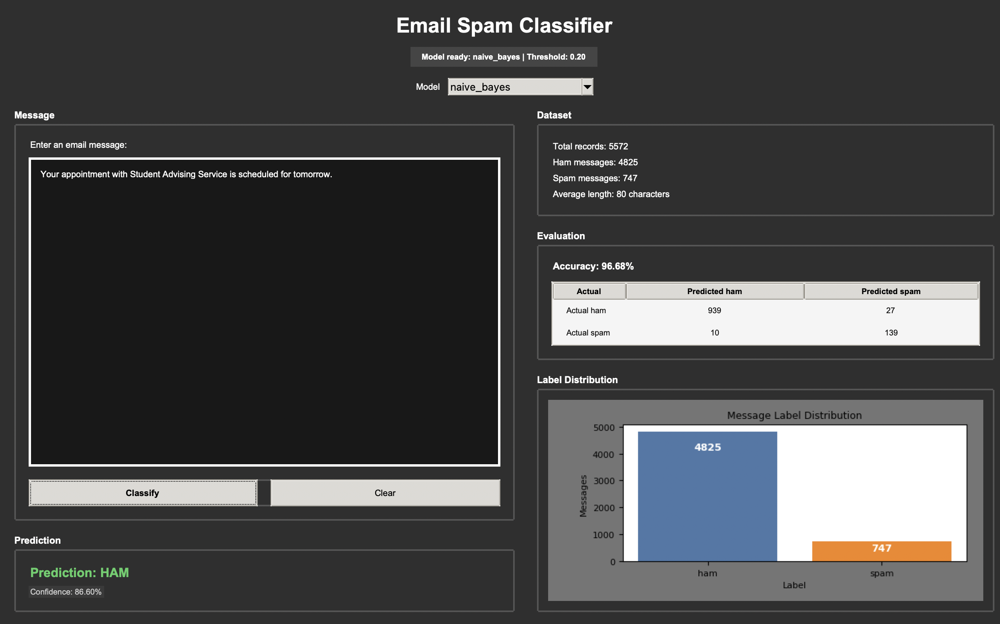

# COMP 472 Mini Project 2: Email classifier

This project is an AI-powered email filtering system for COMP 472. The program will convert email text into numerical features, train a machine learning model with a CSV SMS Spam Collection dataset, predict whether new emails are spam or not, display confidence levels and evaluate the model performance.

## Features

- Loads a data/spam.csv file with label,message columns
- Uses pandas for CSV loading
- Uses TfidfVectorizer from scikit-learn to convert text into numerical features
- Trains a machine learning classifier using Logistic Regression or Naive Bayes from scikit-learn
- Evaluates performance of the model by displaying its accuracy and a confusion matrix
- Displays the predicted label and confidence score
- Generates a chart showing the number of spam and non-spam messages using matplotlib
- Maintains the prediction recursively by continuously accepting user input until the user quit the program

## Project Structure

```email_classifier/
├── data/
│   └── spam.csv
├── src/
│   ├── __init__.py
│   ├── main.py
│   ├── classifier.py
│   ├── dataset.py
│   ├── vectorizer.py
│   ├── training.py
│   ├── evaluation.py
│   └── visualization.py
├── gui/
│   ├── __init__.py
│   └── app.py
├── tests/
│   ├── __init__.py
│   ├── test_classifier.py
│   ├── test_dataset.py
│   ├── test_vectorizer.py
│   ├── test_training.py
│   ├── test_evaluation.py
│   └── test_visualization.py
├── requirements.txt
├── README.md
└── .gitignore
```

## Setup in VS Code

Open the project folder in VS Code, then run these commands in the terminal.

### Windows

```bash
python -m venv .venv
.venv\Scripts\activate
pip install -r requirements.txt
python -m src.main
```

### macOS/ Linux

```bash
python3 -m venv .venv
source .venv/bin/activate
pip install -r requirements.txt
python -m src.main
```

## Architecture


## How it works
### Feature extraction (TF-IDF)
The email text is converted into numerical values using TF-IDF. This gives more importance to words that are useful for classification while reducing the impact of very common words.

### Model Training
The dataset is split into training and testing data. The selected model, either Logistic Regression or Naive Bayes, learns from the training messages and their labels.

### Model Evaluation
After training, the model is tested on unseen messages. The program displays the accuracy and a confusion matrix to show how many ham and spam messages were classified correctly or incorrectly.

### Confidence Score
For each prediction, the model returns probabilities for ham and spam. The program uses these probabilities to choose the final label and display a confidence score.

## Optional GUI
The project also includes a simple Tkinter GUI for demo purposes. It uses the same classes as the command-line version.

Run it from the project folder:
```bash
python -m gui.app
```

## Example Run

```text
==================================================
  Email Classifier - COMP 472
==================================================

Choose a model:
  1. Logistic Regression
  2. Naive Bayes
Model [1]: 1

--- Dataset Information ---
Total records: 5572
Label distribution: {'ham': 4825, 'spam': 747}
Average message length: 80 characters
Model: logistic
Spam threshold: 0.35

Training Model logistic...

--- Evaluation ---
Accuracy: 97.85%
Confusion matrix:
  Classes: ['ham', 'spam']
  ham: [965, 1]
  spam: [23, 126]
------------------------

Enter an email message to classify, or type 'quit' to exit.
Message: Congratulations! You won $5000.
Prediction: SPAM | Confidence: 45.38%

Message: Please submit your project by tomorrow.
Prediction: HAM | Confidence: 94.71%

Message: quit
Goodbye!
```

## Test Input
Try these:
```text
Win a free vacation now!
Your appointment is scheduled for tomorrow.
Congratulations! You have won a free iPhone.
Please submit your assignment before Friday.
Claim your prize now!
Meeting moved to 2 PM tomorrow.
Win a FREE iPhone today!
Reservation at 6pm next Saturday
Congratulations! Claim your tickets now!
```

## Running the basic test
```bash
python -m pytest
```
The included test checks every modules and features of the program. They uses predifined valid CSV created on the spot so they don't load the whole spam.csv dataset every time.

## Screenshots

### CLI



### GUI

#### Example 1: Spam - Logistic Model


#### Example 2: Spam - Naive Bayes Model


#### Example 3: Ham - Logistic Model


#### Example 4: Ham - Naive Bayes Model

