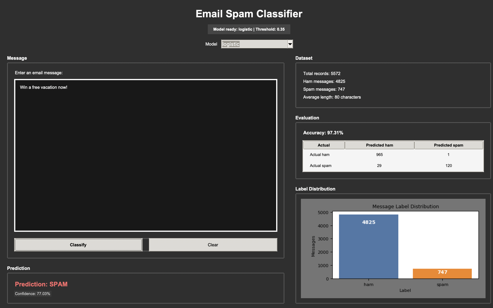
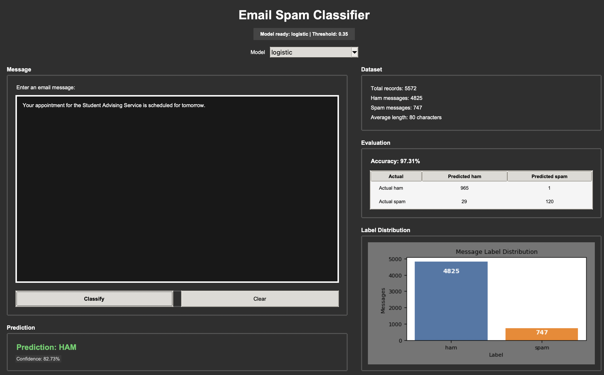
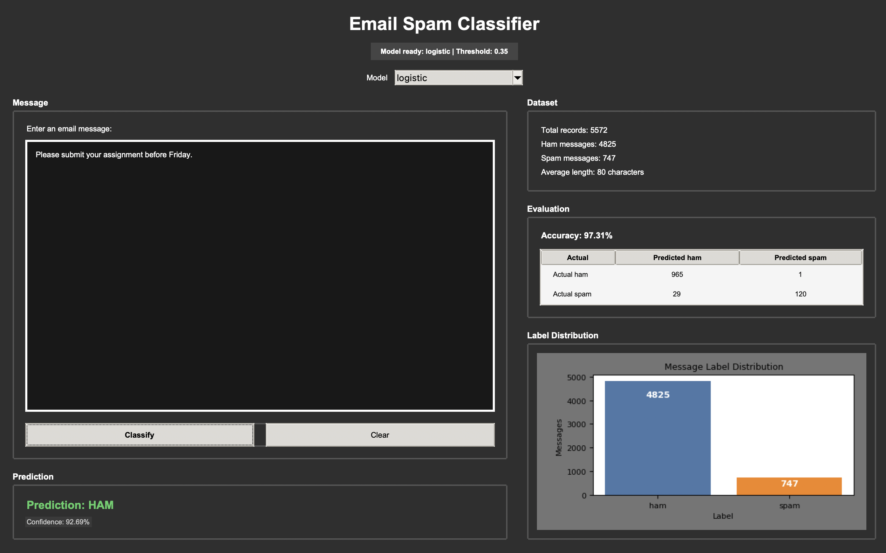

# COMP 472 Mini Project 2: Email classifier
This project is an AI-powered email filtering system for COMP 472. The program will convert email text into numerical features, train a machine learning model with a CSV SMS Spam Collection dataset, predict whether new emails are spam or not, display confidence levels and evaluate the model performance.
## Features
- Loads a data/spam.csv file with label,message columns
- Uses pandas for CSV loading
- Uses TfidfVectorizer from scikit-learn to convert text into numerical features
- Trains a machine learning classifier using Logistic Regression or Naive Bayes from scikit-learn
- Evaluates performance of the model by displaying its accuracy and a confusion matrix
- Displays the predicted label and confidence score
- Generates a chart showing the number of spam and non-spam messages using matplotlib
- Maintains the prediction recursively by continuously accepting user input until the user quit the program
## Project Structure
```email_classifier/
├── data/
│   └── spam.csv
├── src/
│   ├── __init__.py
│   ├── main.py
│   ├── classifier.py
│   ├── conversion.py
│   ├── training.py
│   ├── evaluation.py
│   └── visualization.py
├── gui/
│   ├── __init__.py
│   └── app.py
├── tests/
│   ├── __init__.py
│   ├── test_classifier.py
│   ├── test_conversion.py
│   ├── test_training.py
│   ├── test_evaluation.py
│   └── test_visualization.py
├── requirements.txt
├── README.md
└── .gitignore
```

## Setup in VS Code
Open the project folder in VS Code, then run these commands in the terminal.
### Windows 
```bash
python -m venv .venv
.venv\Scripts\activate
pip install -r requirements.txt
python -m src.main
```
### macOS/ Linux
```bash
python3 -m venv .venv
source .venv/bin/activate
pip install -r requirements.txt
python -m src.main
```
## Architecture
Both the CLI (`src/main.py`) and GUI (`gui/app.py`) use the same `EmailClassifier` coordinator in `src/classifier.py`. The classifier loads `data/spam.csv` through `SpamDataset`, converts messages to TF-IDF features with `TextVectorizer`, trains either Logistic Regression or Naive Bayes, then supports prediction, evaluation, and visualization.


## How it works 
#To-Do Later

## Optional GUI
### Windows 
```bash
python -m venv .venv
.venv\Scripts\activate
pip install -r requirements.txt
python -m gui.app
```
### macOS/ Linux
```bash
python3 -m venv .venv
source .venv/bin/activate
pip install -r requirements.txt
python -m gui.app
```

## Example Run
#To-Do Later

## Test Input
#To-Do Later

## Running the basic test
#To-Do Later

## Screenshots

#### Example 1: Spam


#### Example 2: Spam


#### Example 3: Ham 


#### Example 4: Ham 


